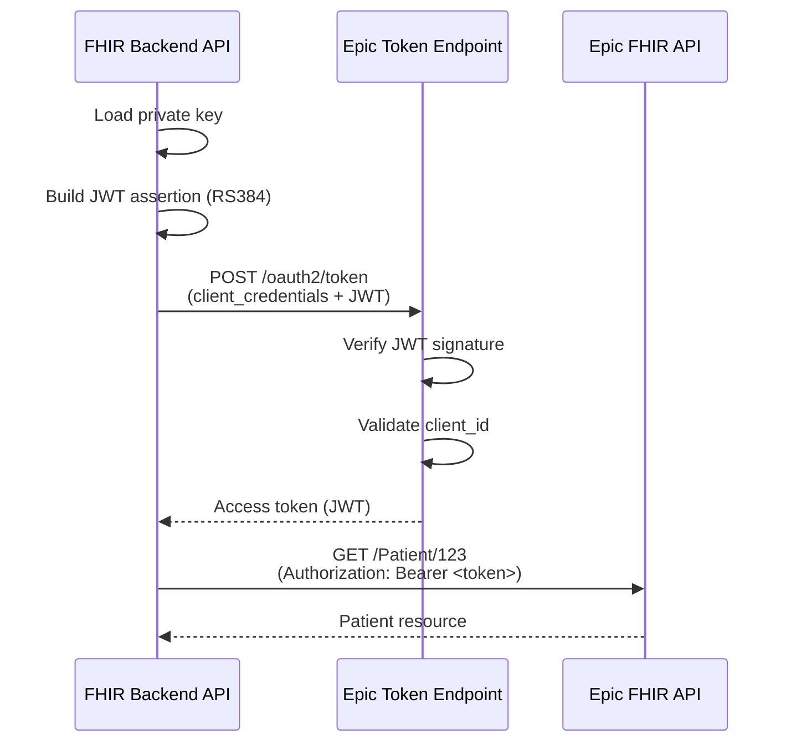

# API Specifications & Technical Reference

**Epic FHIR Backend API** - Complete technical documentation and source of truth for project specifications.

Version: 0.1.0
Last Updated: February 13, 2026

---

## Table of Contents

1. [Project Overview](#project-overview)
2. [Architecture](#architecture)
3. [API Endpoints](#api-endpoints)
4. [Configuration](#configuration)
5. [Data Models](#data-models)
6. [Authentication Flow](#authentication-flow)
7. [Error Handling](#error-handling)
8. [Development Guide](#development-guide)

---

## Project Overview

### Purpose
Backend OAuth2 authentication service for Epic FHIR API integration using JWT client assertions (SMART Backend Services specification).

### Technology Stack
- **Framework:** FastAPI 0.121.2
- **Server:** Uvicorn 0.38.0
- **Language:** Python 3.11
- **Environment:** Conda (`fhir-app`)
- **Authentication:** OAuth2 Client Credentials + JWT (RS384)

### Current Status
- ✅ Server operational on port 8001
- ✅ JWT generation and signing working
- ✅ Epic API integration implemented
- ⚠️ Pending: Epic client registration completion

---

## Architecture

### Directory Structure

```
fhir-sample-app/
├── app/
│   ├── __init__.py              # Package initializer
│   ├── main.py                  # FastAPI app instance & route registration
│   ├── config.py                # Configuration loader (os.getenv)
│   ├── models.py                # Pydantic response models
│   ├── routes/
│   │   ├── __init__.py
│   │   ├── health.py            # Health check endpoint
│   │   ├── auth.py              # OAuth2 token endpoint
│   │   └── debug.py             # Debug/troubleshooting endpoints
│   └── services/
│       ├── __init__.py
│       └── epic_auth.py         # JWT generation & Epic API client
├── .keys/                       # Private keys (gitignored)
│   ├── privatekey.pem           # RS384 private key
│   └── publickey.pem            # RS384 public key
├── .env                         # Environment config (gitignored)
├── .env.example                 # Environment template
├── requirements.txt             # Python dependencies
├── README.md                    # User documentation
└── API_SPECS.md                 # This file (technical specs)
```

### Component Responsibilities

| Component | Responsibility |
|-----------|---------------|
| `main.py` | App initialization, route registration, root endpoint |
| `config.py` | Load environment variables, provide settings singleton |
| `models.py` | Define API request/response schemas with Pydantic |
| `routes/health.py` | Simple health check for monitoring |
| `routes/auth.py` | OAuth2 token endpoint, error handling |
| `routes/debug.py` | JWT inspection, public key retrieval, troubleshooting |
| `services/epic_auth.py` | JWT assertion builder, Epic token fetcher |

---

## API Endpoints

### Base URL
```
http://localhost:8001
```

### Endpoint List

| Method | Path | Purpose | Status |
|--------|------|---------|--------|
| GET | `/` | Root endpoint | ✅ Working |
| GET | `/health/` | Health check | ✅ Working |
| POST | `/auth/token` | Get Epic access token | ⚠️ Pending Epic registration |
| GET | `/debug/jwt` | Inspect JWT assertion | ✅ Working |
| GET | `/debug/public-key` | Get public key for Epic | ✅ Working |
| POST | `/debug/token-request` | View token request structure | ✅ Working |
| GET | `/docs` | Interactive API docs (Swagger) | ✅ Working |
| GET | `/redoc` | Alternative API docs | ✅ Working |

---

### Endpoint Details

#### `GET /`
**Purpose:** Root endpoint with basic info

**Response:**
```json
{
  "message": "Epic FHIR Backend API",
  "version": "0.1.0",
  "docs": "/docs"
}
```

**Status Codes:**
- `200 OK` - Success

---

#### `GET /health/`
**Purpose:** Health check for monitoring and load balancers

**Response:**
```json
{
  "status": "healthy"
}
```

**Status Codes:**
- `200 OK` - Service is healthy

**Use Cases:**
- Kubernetes liveness/readiness probes
- Load balancer health checks
- Monitoring systems

---

#### `POST /auth/token`
**Purpose:** Obtain OAuth2 access token from Epic FHIR

**Request:**
- Method: POST
- Content-Type: application/json
- Body: None required

**Success Response (After Epic Registration):**
```json
{
  "access_token": "eyJ0eXAiOiJKV1QiLCJhbGc...",
  "token_type": "Bearer",
  "expires_in": 3600,
  "scope": "system/*.read"
}
```

**Current Response (Invalid Client):**
```json
{
  "detail": "Failed to obtain token: Epic returned 400: {'error': 'invalid_client', 'error_description': None}"
}
```

**Status Codes:**
- `200 OK` - Token obtained successfully
- `500 Internal Server Error` - Epic API error or configuration issue

**Implementation Details:**
1. Builds JWT assertion with RS384 signing
2. Posts to Epic token endpoint with client credentials grant
3. Returns access token for FHIR API calls

**JWT Claims:**
```json
{
  "iss": "<client_id>",
  "sub": "<client_id>",
  "aud": "https://fhir.epic.com/interconnect-fhir-oauth/oauth2/token",
  "iat": 1739476234,
  "exp": 1739476534,
  "jti": "<client_id>-<timestamp>"
}
```

---

#### `GET /debug/jwt`
**Purpose:** Inspect JWT assertion for debugging

**Response:**
```json
{
  "jwt_assertion": "eyJhbGciOiJSUzM4NCIsInR5cCI6IkpXVCJ9...",
  "decoded_payload": {
    "iss": "36914b8f-56b7-4212-84d2-a70d48674af9",
    "sub": "36914b8f-56b7-4212-84d2-a70d48674af9",
    "aud": "https://fhir.epic.com/interconnect-fhir-oauth/oauth2/token",
    "iat": 1739476234,
    "exp": 1739476534,
    "jti": "36914b8f-56b7-4212-84d2-a70d48674af9-1739476234.123"
  },
  "config": {
    "client_id": "36914b8f-56b7-4212-84d2-a70d48674af9",
    "token_endpoint": "https://fhir.epic.com/interconnect-fhir-oauth/oauth2/token",
    "key_path": "./.keys/privatekey.pem"
  }
}
```

**Status Codes:**
- `200 OK` - JWT generated successfully
- `500 Internal Server Error` - Key loading or JWT encoding error

**Use Cases:**
- Verify JWT structure during development
- Check claim values before Epic submission
- Troubleshoot signing issues

---

#### `GET /debug/public-key`
**Purpose:** Retrieve public key for Epic registration

**Response:**
```json
{
  "public_key": "-----BEGIN PUBLIC KEY-----\nMIIBIjANBgkqhkiG9w0BAQEFAAOCAQ8AMIIBCgKCAQEA...\n-----END PUBLIC KEY-----",
  "instructions": "Copy the public_key value above and register it with Epic at their FHIR sandbox portal",
  "client_id": "36914b8f-56b7-4212-84d2-a70d48674af9"
}
```

**Status Codes:**
- `200 OK` - Public key found
- `200 OK` with error field - Public key not found

**Use Cases:**
- Quick access to public key for Epic portal
- Verify key format
- Share key with team members

---

#### `POST /debug/token-request`
**Purpose:** View token request structure without sending

**Response:**
```json
{
  "endpoint": "https://fhir.epic.com/interconnect-fhir-oauth/oauth2/token",
  "method": "POST",
  "data": {
    "grant_type": "client_credentials",
    "client_assertion_type": "urn:ietf:params:oauth:client-assertion-type:jwt-bearer",
    "client_assertion": "eyJhbGciOiJSUzM4NCIsInR5cCI6IkpXVCJ9...",
    "scope": "system/*.read"
  },
  "note": "client_assertion is truncated for display"
}
```

**Status Codes:**
- `200 OK` - Request structure generated

**Use Cases:**
- Verify OAuth2 parameters
- Debug request format
- Compare with Epic documentation

---

## Configuration

### Environment Variables

| Variable | Type | Required | Default | Description |
|----------|------|----------|---------|-------------|
| `EPIC_CLIENT_ID` | string | No | `""` | Production Epic client ID |
| `EPIC_CLIENT_ID_NON_PROD` | string | Yes | `""` | Sandbox Epic client ID (currently active) |
| `EPIC_PRIVATE_KEY_PATH` | string | Yes | `""` | Path to RS384 private key file |
| `EPIC_TOKEN_ENDPOINT` | string | No | Epic sandbox URL | Epic OAuth2 token endpoint |

### Current Configuration

```env
EPIC_CLIENT_ID=your-epic-client-id
EPIC_CLIENT_ID_NON_PROD=36914b8f-56b7-4212-84d2-a70d48674af9
EPIC_PRIVATE_KEY_PATH=./.keys/privatekey.pem
EPIC_TOKEN_ENDPOINT=https://fhir.epic.com/interconnect-fhir-oauth/oauth2/token
```

### Configuration Loading

```python
# app/config.py
import os
from dotenv import load_dotenv

load_dotenv()

class Settings:
    def __init__(self):
        self.EPIC_CLIENT_ID = os.getenv("EPIC_CLIENT_ID", "")
        self.EPIC_CLIENT_ID_NON_PROD = os.getenv("EPIC_CLIENT_ID_NON_PROD", "")
        self.EPIC_PRIVATE_KEY_PATH = os.getenv("EPIC_PRIVATE_KEY_PATH", "")
        self.EPIC_TOKEN_ENDPOINT = os.getenv(
            "EPIC_TOKEN_ENDPOINT",
            "https://fhir.epic.com/interconnect-fhir-oauth/oauth2/token"
        )

settings = Settings()
```

---

## Data Models

### TokenResponse

```python
class TokenResponse(BaseModel):
    access_token: str
    token_type: str = "Bearer"
    expires_in: Optional[int] = None
    scope: Optional[str] = None
```

**Usage:** Response model for `/auth/token` endpoint

**Fields:**
- `access_token` (required): JWT access token from Epic
- `token_type` (default: "Bearer"): OAuth2 token type
- `expires_in` (optional): Token lifetime in seconds
- `scope` (optional): Granted OAuth2 scopes

---

### HealthResponse

```python
class HealthResponse(BaseModel):
    status: str
```

**Usage:** Response model for `/health/` endpoint

**Fields:**
- `status` (required): Health status string (e.g., "healthy")

---

## Authentication Flow

### SMART Backend Services (Client Credentials)



### JWT Assertion Structure

**Header:**
```json
{
  "alg": "RS384",
  "typ": "JWT"
}
```

**Payload:**
```json
{
  "iss": "36914b8f-56b7-4212-84d2-a70d48674af9",
  "sub": "36914b8f-56b7-4212-84d2-a70d48674af9",
  "aud": "https://fhir.epic.com/interconnect-fhir-oauth/oauth2/token",
  "iat": 1739476234,
  "exp": 1739476534,
  "jti": "36914b8f-56b7-4212-84d2-a70d48674af9-1739476234.123"
}
```

**Signature:**
- Algorithm: RS384 (RSA-SHA384)
- Key: Private key from `EPIC_PRIVATE_KEY_PATH`

---

## Error Handling

### Error Response Format

```json
{
  "detail": "Error message describing the issue"
}
```

### Common Errors

| Error | HTTP Code | Cause | Resolution |
|-------|-----------|-------|------------|
| `invalid_client` | 500 | Client ID not registered with Epic | Complete Epic registration, upload public key |
| `FileNotFoundError` | 500 | Private key file not found | Verify `EPIC_PRIVATE_KEY_PATH` in `.env` |
| `Connection timeout` | 500 | Cannot reach Epic endpoint | Check network, verify Epic endpoint URL |
| `Invalid JWT signature` | 500 | Public key mismatch at Epic | Re-upload correct public key to Epic |

---

## Development Guide

### Running Locally

```bash
# Activate environment
conda activate fhir-app

# Start server (development mode)
uvicorn app.main:app --reload --host 0.0.0.0 --port 8001

# Start server (production mode)
uvicorn app.main:app --host 0.0.0.0 --port 8001 --workers 4
```

### Adding New Features

#### 1. Add New Endpoint

```python
# app/routes/my_feature.py
from fastapi import APIRouter

router = APIRouter()

@router.get("/my-endpoint")
async def my_endpoint():
    return {"message": "Hello"}
```

```python
# app/main.py
from app.routes import my_feature

app.include_router(my_feature.router, prefix="/feature", tags=["feature"])
```

#### 2. Add New Service

```python
# app/services/my_service.py
from app.config import settings

async def do_something():
    # Business logic here
    return result
```

#### 3. Add New Model

```python
# app/models.py
from pydantic import BaseModel

class MyRequest(BaseModel):
    field1: str
    field2: int
```

### Testing Commands

```bash
# Health check
curl http://localhost:8001/health/

# Get token
curl -X POST http://localhost:8001/auth/token

# Debug JWT
curl http://localhost:8001/debug/jwt

# Get public key
curl http://localhost:8001/debug/public-key
```

---

## Dependencies

### Production Dependencies

```txt
fastapi==0.121.2
uvicorn==0.38.0
python-dotenv==1.2.1
python-jose[cryptography]==3.5.0
requests==2.32.5
pydantic==2.12.4
```

### Dependency Purpose

| Package | Purpose |
|---------|---------|
| `fastapi` | Web framework for API development |
| `uvicorn` | ASGI server for running FastAPI |
| `python-dotenv` | Load `.env` file into environment variables |
| `python-jose[cryptography]` | JWT encoding/decoding with RS384 support |
| `requests` | HTTP client for Epic API calls |
| `pydantic` | Data validation and response models |

---

## Version History

### v0.1.0 (Current)
- ✅ Initial FastAPI setup
- ✅ JWT assertion generation with RS384
- ✅ Epic OAuth2 integration
- ✅ Health check endpoint
- ✅ Debug endpoints for troubleshooting
- ✅ Environment-based configuration
- ⚠️ Pending Epic client registration

### Planned Features
- [ ] Token caching mechanism
- [ ] FHIR API query endpoints (Patient, Observation, etc.)
- [ ] Request/response logging
- [ ] Rate limiting
- [ ] Unit tests
- [ ] Integration tests
- [ ] Production deployment guide

---

## Epic Integration Checklist

- [x] Generate RS384 key pair
- [x] Build JWT assertion with correct claims
- [x] Implement OAuth2 client credentials flow
- [ ] Register application at Epic FHIR portal
- [ ] Upload public key to Epic
- [ ] Verify client ID configuration
- [ ] Test token endpoint
- [ ] Implement FHIR API queries

---

## Support & Resources

- **Project Repository:** (Add Git URL)
- **Epic FHIR Docs:** https://fhir.epic.com/
- **SMART Specification:** http://hl7.org/fhir/uv/bulkdata/authorization/
- **FastAPI Docs:** https://fastapi.tiangolo.com/
- **JWT Debugger:** https://jwt.io/

---

**Document Version:** 1.0
**Last Updated:** February 13, 2026
**Maintained By:** Development Team
